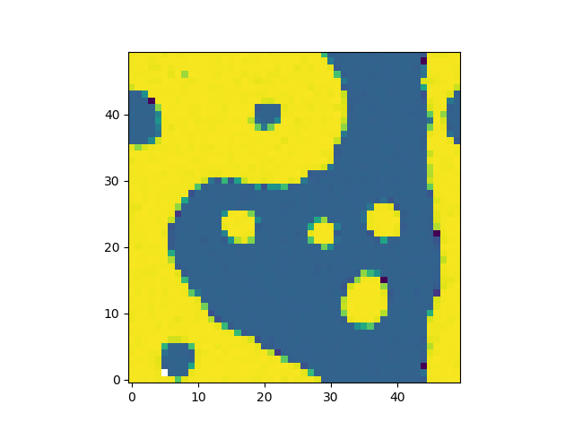
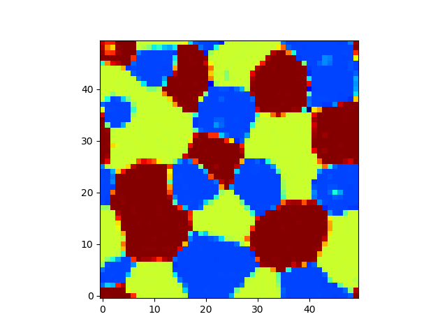

# mix_mpcd
Multi-particle dynamics simulation of multi-phasic fluids

## Building

We use cmake. Typically you would type:
```
mkdir build
cd build
cmake ..
make
```

We rely on the `boost::program_options` which must be installed prior to
building the program. We also use modern C++ features, such that you will
require a modern compiler (tested with g++-4.9).

## Running

Run examples: in `build` directory type
```
./mpcd ../examples/binary/
```

Program interaction is fairly limited but you can change the simulation
parameters in `example/parameters`.

Plot: in plot directory type
```
python2 plot.py ../examples/binary/
```

## Samples


